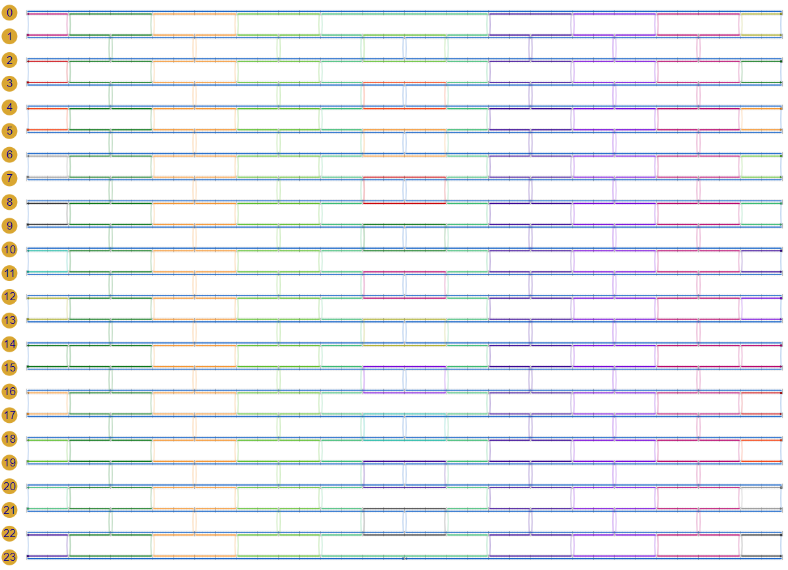
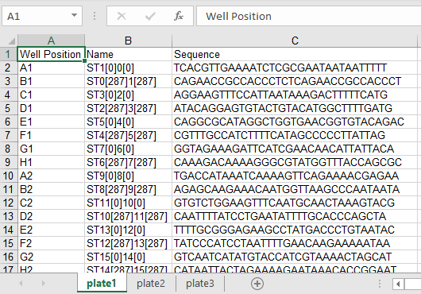

# scadnano Python scripting tutorial

The goal of this tutorial is to create a design for a 24-helix DNA origami rectangle, with "twist correction". (See [this paper](https://doi.org/10.1038/nchem.1070) for an explanation of twist correction in 2D DNA origami) 

See the [web interface tutorial](https://github.com/UC-Davis-molecular-computing/scadnano/blob/master/tutorial/tutorial.md) to see how to create this design manually in the scadnano web interface.


## Prerequisite knowledge

This tutorial assumes a basic knowledge of Python. Python is a very readable programming language, so if you know how to program, but not in Python, then you should be able to follow along. But if you are confused by some syntax, it might help to read the [Python tutorial](https://docs.python.org/3/tutorial/).

Before going further in this tutorial, please read through the help for the web interface, specifically the description of [terminology](https://github.com/UC-Davis-molecular-computing/scadnano#terminology). We will use the terms described there in the rest of this tutorial.

It will also be helpful to have available the [API documentation](https://scadnano-python-package.readthedocs.io). In this tutorial, we won't explain the full details of every function and method we use. If you wonder how it works, consult the API documentation.

If you do know Python but haven't used the (somewhat recently developed) [type hints](https://docs.python.org/3/library/typing.html), then some of the syntax of function declarations may look strange. They are declaring argument (input) and return (output) types, for instance

```python
def f(x, n):
    return len(x) / n
```

can be annotated as follows to declare that it takes a string and an integer as input and returns a floating-point number:

```python
def f(x: str, n: int) -> float:
    return len(x) / n
```

Functions with no return type return `None`:

```python
def g(x: int) -> None:
    print(x*2)
```


## Installation

First, follow the [installation instructions](../README.md#installation) to install the scadnano Python package.


## Viewing completed design

The design will look like this when we are done:


The completed design is available as a [`.sc` file](https://raw.githubusercontent.com/UC-Davis-molecular-computing/scadnano-python-package/master/examples/tutorial-examples/24_helix_rectangle.sc) readable by scadnano. Download it and save it somewhere on your local file system.

To view it, first open scadnano in your browser: 
https://scadnano.org.
Currently only [Chrome](https://www.google.com/chrome/) 
or [Firefox](https://www.mozilla.org/en-US/firefox/)
are supported.

To open the file in scadnano, drag the file from your computer's file browser onto the open scadnano page in your web browser. 
Alternatively, select File&rarr;Open, and choose the file you downloaded. 
The design should look similar to the first screenshot in the tutorial.


## Create empty design

Now we will see how to create the design using the Python scripting package. 
We first note that the module [origami_rectangle](../scadnano/origami_rectangle.py), included as part of the scadnano Python package, can be used to create DNA origami rectangles. However, for the purpose of this tutorial, we will see how to do it just using the scadnano Python module in [scadnano.py](../scadnano/scadnano.py).

Create an empty text file named `24_helix_rectangle.py`, and paste the following text into it:

```python
import scadnano as sc


def main() -> None:
    design = create_design()
    design.write_scadnano_file()


def create_design() -> sc.Design:
    design = sc.Design()
    return design


if __name__ == '__main__':
    main()
```

The line `design = create_design()` creates an empty design with no helices and no strands, using no grid.
The line `design.write_scadnano_file()` writes the design to a `.sc` file with the same name (other than the file extension) of the currently running script.

Run this file from the command line by opening a terminal window, changing directory to the location of the file `24_helix_rectangle.py`, and typing 

```console
python 24_helix_rectangle.py
```

Depending on your installation, you may have to type `python3` instead of `python`:

```console
python3 24_helix_rectangle.py
```

In the same directory, a file named `24_helix_rectangle.sc` should appear. Open it in a text editor. The contents of the file should be something similar to this:

```json
{
  "version": "0.14.0",
  "grid": "none",
  "helices": [],
  "strands": []
}
```

This is a file format called [JSON format](https://en.wikipedia.org/wiki/JSON). When using the web interface, it is not typically necessary to think about how the design is represented as JSON, but when using the scripting library, you may find yourself wanting to inspect the output while fixing bugs, so it is helpful to be familiar with how the design is represented. 


## Add helices

As you can see, the simple script we wrote generates a design with no helices, no strands, using no grid. Now we see how to add helices in the square grid.

We want 24 helices, stacked vertically on the square grid. We can give each helix an explicit [`grid_position`](https://scadnano-python-package.readthedocs.io/en/latest/#scadnano.Helix.grid_position) coordinate, but it turns out that if we just give a list of helices using the square grid with no `grid_position`'s set, they will be automatically stacked vertically. We need to ensure each helix has enough offsets for all the bases we will need, using the `max_offset` parameter in the `Helix` constructor. We will use a standard [M13mp18](https://www.ncbi.nlm.nih.gov/nuccore/X02513.1) scaffold strand, of length 7249. We won't use all of it, but we'll use most of it. It turns out that 288 offsets will be enough for us to use close to 7000 of the bases of the scaffold.

Change the Python file as follows. We marked the changed lines in `create_design()` with `###`:

```python
import scadnano as sc


def main() -> None:
    design = create_design()
    design.write_scadnano_file()


def create_design():
    helices = [sc.Helix(max_offset=288) for _ in range(24)] ###
    design = sc.Design(helices=helices, grid=sc.square)     ###
    return design


if __name__ == '__main__':
    main()
```

To save space, below we will omit the `import scadnano as sc` statement, the `main()` function definition, and `if __name__ == '__main__'` block at the bottom, none of which will change for most of the tutorial, and we will write only the `create_design()` function, as well as any other functions it calls, as we write them:

```python
def create_design():
    helices = [sc.Helix(max_offset=288) for _ in range(24)] ###
    design = sc.Design(helices=helices, grid=sc.square)     ###
    return design
```

Execute this script and inspect the output `24_helix_rectangle.sc` file:

```json
{
  "version": "0.14.0",
  "grid": "square",
  "helices": [
    {"max_offset": 288, "grid_position": [0, 0]},
    {"max_offset": 288, "grid_position": [0, 1]},
    {"max_offset": 288, "grid_position": [0, 2]},
    {"max_offset": 288, "grid_position": [0, 3]},
    {"max_offset": 288, "grid_position": [0, 4]},
    {"max_offset": 288, "grid_position": [0, 5]},
    {"max_offset": 288, "grid_position": [0, 6]},
    {"max_offset": 288, "grid_position": [0, 7]},
    {"max_offset": 288, "grid_position": [0, 8]},
    {"max_offset": 288, "grid_position": [0, 9]},
    {"max_offset": 288, "grid_position": [0, 10]},
    {"max_offset": 288, "grid_position": [0, 11]},
    {"max_offset": 288, "grid_position": [0, 12]},
    {"max_offset": 288, "grid_position": [0, 13]},
    {"max_offset": 288, "grid_position": [0, 14]},
    {"max_offset": 288, "grid_position": [0, 15]},
    {"max_offset": 288, "grid_position": [0, 16]},
    {"max_offset": 288, "grid_position": [0, 17]},
    {"max_offset": 288, "grid_position": [0, 18]},
    {"max_offset": 288, "grid_position": [0, 19]},
    {"max_offset": 288, "grid_position": [0, 20]},
    {"max_offset": 288, "grid_position": [0, 21]},
    {"max_offset": 288, "grid_position": [0, 22]},
    {"max_offset": 288, "grid_position": [0, 23]}
  ],
  "strands": []
}
```

At this point, and periodically throughout the tutorial, reload the file `24_helix_rectangle.sc` in the scadnano web interface, to verify that it resembles the design you expect. (Recall that this can be done either by clicking File&rarr;Open or by dragging the file to the web browser opened to the scadnano site.) Unfortunately, since it is a browser-based application, there's no way to have it automatically reload whenever your local `24_helix_rectangle.sc` file changes (for the same reason you wouldn't want arbitrary websites to start reading files on your computer without you explicitly uploading them).

At this point, the design should look like this:


## Add scaffold "precursor strands"

One can specify a design by explicitly listing every `Strand`, each of which is specified by listing every `Domain` (and if included, every `Loopout`). The point of a scripting library, however, is to automate tedious tasks by enabling a few loops to iterate over many of the `Strand`'s.

However, it can be difficult to see how to write a single loop, or even a small number of loops, to specify a complex design such as this one. An alternate simple way to specify a design is instead to visualize the design as consisting of several long strands, two per helix, which have had nicks and crossovers added. This is how we will design this DNA origami.

We do this by creating a "precursor" design, which is not the final design, and then editing it by adding nicks and crossovers, which is done by calling methods on the `Design` object.

The scaffold is a good starting point. It is one long strand, but we won't specify it as such. Instead, we will specify it by drawing one strand on each helix, spanning the full length, and then modifying these strands with crossovers, eventually joining them into one long strand.

We can use the function [Design.draw_strand](https://scadnano-python-package.readthedocs.io/en/latest/#scadnano.Design.draw_strand) to draw strands. It takes two integer arguments: a helix and an offset, and uses "chained method calls" to give a short syntax for specifying strands. In this case, depending on the helix, we either want the strand (in order from 5' end to 3' end) to start at offset 0 and move forward (right) by 288, or start at offset 288 and move in reverse by 288 (i.e., move by -288). The bottommost helix, 23, is an exception, where we want the "nick" to be, so we actually want to draw two strands, with a break between them at the halfway point 144:

```python
def create_design() -> sc.Design:
    helices = [sc.Helix(max_offset=288) for _ in range(24)]
    design = sc.Design(helices=helices, grid=sc.square)

    add_scaffold_precursors(design)  ###

    return design


def add_scaffold_precursors(design: sc.Design) -> None:
    for helix in range(0, 23, 2):  # scaffold goes forward on even helices
        design.draw_strand(helix, 0).move(288).as_scaffold()
    for helix in range(1, 23, 2):  # scaffold goes reverse on odd helices
        design.draw_strand(helix, 288).move(-288).as_scaffold()
    design.draw_strand(23, 288).move(-144).as_scaffold()  # bottom part of scaffold has a "nick"
    design.draw_strand(23, 144).move(-144).as_scaffold()  #
```

We drew the scaffold precursor on helix 23 as two strands, each half the length (144) of those on other helices (288).
But we could alternately think of it as one strand of length 288 that has had a "nick" created in the middle, so we could have created it similarly to the other helices and then called the method [Design.add_nick](https://scadnano-python-package.readthedocs.io/en/latest/#scadnano.Design.add_nick). This is how we will create the staples later, which have many more nicks on each helix than the scaffold.

The chained method calls in this case don't show how to create a strand with crossovers; see the [example on the README page](https://github.com/UC-Davis-molecular-computing/scadnano-python-package#abbreviated-syntax-with-chained-methods) for a more representative example of creating a complete strand spanning several helices with chained method calls.

Execute the script. The file `24_helix_rectangle.sc` is getting large now, so we won't show the whole thing, but the `strands` field should be non-empty now and start something like this:

```json
"strands": [
  {
    "color": "#0066cc",
    "domains": [
      {"helix": 0, "forward": true, "start": 0, "end": 288}
    ],
    "is_scaffold": true
  },
  {
    "color": "#0066cc",
    "domains": [
      {"helix": 2, "forward": true, "start": 0, "end": 288}
    ],
    "is_scaffold": true
  },
  {
    "color": "#0066cc",
    "domains": [
      {"helix": 4, "forward": true, "start": 0, "end": 288}
    ],
    "is_scaffold": true
  },
  {
    "color": "#0066cc",
...
```

The design should look like this:


## Aside: offsets are inclusive on the left and exclusive on the right

Note that each domain has a `start` (left) and `end` (right) offset. These follow the standard programming convention of being inclusive for `start` and exclusive for `end`. In other words, for each of these strands, which all have `start`=0 and `end`=288, the set of offsets that each occupies is {0, 1, 2, ..., 286, 287}. This can be confusing, but it often makes code easier to think about. For example, setting the `end` of one strand to be equal to the `start` of another means that they are adjacent (i.e., appear to be one strand with a "nick" at the shared offset). If you find the two scaffold precursor strands on helix 23 in the file `24_helix_rectangle.sc`, you can see this:

```json
  {
    "color": "#0066cc",
    "domains": [
      {"helix": 23, "forward": false, "start": 144, "end": 288}
    ],
    "is_scaffold": true
  },
  {
    "color": "#0066cc",
    "domains": [
      {"helix": 23, "forward": false, "start": 0, "end": 144}
    ],
    "is_scaffold": true
  }
```


## Add crossovers to scaffold

Now we connect the scaffold into a single strand by adding crossovers. The "inner" crossovers (a.k.a., the "seam") are so-called *full crossovers*, meaning that *two* strands jump from one helix to the next, depicted here:


This contrasts a so-called *half crossover*, depicted here:


We add full crossovers at the seam and half crossovers at the left and right edges of the helices. 
Note that the offset specified for a full crossover is that of the half crossover on the right side. 
Note also that when specifying the offset of a half crossover, it is inclusive, even if it occurs on the `end` offset of a domain, e.g., the half crossover at offset 287 (inclusive) joins two domains whose `end` offsets are 288 (exclusive).


```python
def create_design() -> sc.Design:
    helices = [sc.Helix(max_offset=288) for _ in range(24)]
    design = sc.Design(helices=helices, grid=sc.square)

    add_scaffold_precursors(design)
    add_scaffold_crossovers(design)  ###

    return design

def add_scaffold_crossovers(design: sc.Design) -> None:
    for helix in range(1, 23, 2):  # scaffold interior crossovers
        design.add_full_crossover(helix=helix, helix2=helix + 1, offset=144, forward=False)

    for helix in range(0, 23, 2):  # scaffold edges crossovers
        design.add_half_crossover(helix=helix, helix2=helix + 1, offset=0, forward=True)
        design.add_half_crossover(helix=helix, helix2=helix + 1, offset=287, forward=True) # offset inclusive
```


If you inspect carefully, you'll see that we are adding some crossovers (the "interior" crossovers) at offsets where nicks, i.e., 5'/3' ends of strands, do not exist already; the nicks are automatically created when calling `add_full_crossover`. This only works for `add_full_crossover`; the method `add_half_crossover` can only be given offsets corresponding to 5'/3' ends of strands.

Now the design should look like this:


We've completed the scaffold strand! On to the staple strands.


## Add staple precursors

We used chained method calls to create scaffold "precursor" strands, 
i.e., one long strand per helix, going the opposite direction as the scaffold.
In subsequent sections we will also add nicks and crossovers to these,
to create the staple strands.
It is also possible, though typically more verbose, to explicitly create `Domain` objects, 
to be passed into the `Strand` constructor. 
For the staple precursor strands we do this to show how it works.

Each `Strand` is specified primarily by a list of `Domain`'s, and each `Domain` is specified primarily by 4 fields: 
integer `helix` (actually, *index* of a helix),
Boolean `forward`: direction of the `Domain`, i.e., is its 3' end at a higher or lower offset than its 5' end? In other words is the strand arrow pointing to the right (forward) or left (reverse),
and integer `start` and `end` offsets.


To add staples, we use the method `design.add_strand`. In general, modifying an existing design should always be done through methods rather than modifying the fields directly. In other words, don't write to the list `design.strands` directly, although it is safe to access the fields read-only.

```python
def create_design() -> sc.Design:
    helices = [sc.Helix(max_offset=288) for _ in range(24)]
    design = sc.Design(helices=helices, grid=sc.square)

    add_scaffold_precursors(design)
    add_scaffold_crossovers(design)

    add_staple_precursors(design) ###

    return design

def add_staple_precursors(design: sc.Design) -> None:
    staples = [sc.Strand([sc.Domain(helix=helix, forward=helix % 2 == 1, start=0, end=288)])
               for helix in range(24)]
    for staple in staples:
        design.add_strand(staple)
```

The design should now look like this:


## Add crossovers to staples

The staple crossovers are spaced fairly regularly between any two pairs of adjacent helices, the only complications being 
1) the leftmost crossover is at offset 16 or 32 depending on the parity of the two helix indices, and
2) We omit staple crossovers at the seam.

```python
def create_design() -> sc.Design:
    helices = [sc.Helix(max_offset=288) for _ in range(24)]
    design = sc.Design(helices=helices, grid=sc.square)

    add_scaffold_precursors(design)
    add_scaffold_crossovers(design)

    add_staple_precursors(design)
    add_staple_crossovers(design) ###

    return design

def add_staple_crossovers(design: sc.Design) -> None:
    for helix in range(23):
        start_offset = 16 if helix % 2 == 0 else 32
        for offset in range(start_offset, 288, 32):
            if offset != 144:  # skip crossover near seam
                design.add_full_crossover(helix=helix, helix2=helix + 1, offset=offset,
                                          forward=helix % 2 == 1)
```


The design should now look like this:




## Add nicks to staples

The nicks are spacedly regularly between staples:

```python
def create_design() -> sc.Design:
    helices = [sc.Helix(max_offset=288) for _ in range(24)]
    design = sc.Design(helices=helices, grid=sc.square)

    add_scaffold_precursors(design)
    add_scaffold_crossovers(design)

    add_staple_precursors(design)
    add_staple_crossovers(design)
    add_staple_nicks(design) ###

    return design


def add_staple_nicks(design: sc.Design) -> None:
    for helix in range(24):
        start_offset = 24 if helix % 2 == 0 else 40
        for offset in range(start_offset, 272, 32):
            design.add_nick(helix, offset, forward=helix % 2 == 1)
```


The design is now mostly complete:


## Add deletions for twist correction

To achieve "twist correction" (See [this paper](https://www.nature.com/articles/nchem.1070) for an explanation of twist correction in 2D DNA origami), we add deletions every 3rd "column" of staples:

```python
def create_design() -> sc.Design:
    helices = [sc.Helix(max_offset=288) for _ in range(24)]
    design = sc.Design(helices=helices, grid=sc.square)

    add_scaffold_precursors(design)
    add_scaffold_crossovers(design)

    add_staple_precursors(design)
    add_staple_crossovers(design)
    add_staple_nicks(design)

    add_twist_correction_deletions(design) ###

    return design


def add_twist_correction_deletions(design: sc.Design) -> None:
    for helix in range(24):
        for offset in range(19, 286, 48):
            design.add_deletion(helix, offset)
```

The design now looks like it did at the top:


## Assign DNA sequence to scaffold

Finally, we complete the design by assigning a DNA sequence to the scaffold, which will assign the complementary sequence to the appropriate staples. This is, in a sense, the primary function of [cadnano](https://cadnano.org/) and scadnano: to translate a desired abstract strand design, together with knowledge of a concrete DNA sequence for the scaffold, into the appropriate sequences for the staples to enable them to bind to the scaffold where we want. 

If you have a particular strand and sequence you would like to assign, you can call [`Design.assign_dna`](https://scadnano-python-package.readthedocs.io/en/latest/#scadnano.Design.assign_dna). However, in the common case that your design has exactly one scaffold, and you want to assign the sequence of [M13mp18](https://www.ncbi.nlm.nih.gov/nuccore/X02513.1) to it, there is a convenience method [`Design.assign_m13_to_scaffold`](https://scadnano-python-package.readthedocs.io/en/latest/#scadnano.Design.assign_m13_to_scaffold):

```python
def create_design() -> sc.Design:
    helices = [sc.Helix(max_offset=288) for _ in range(24)]
    design = sc.Design(helices=helices, grid=sc.square)

    add_scaffold_precursors(design)
    add_scaffold_crossovers(design)

    add_staple_precursors(design)
    add_staple_crossovers(design)
    add_staple_nicks(design)

    add_twist_correction_deletions(design)
    design.assign_m13_to_scaffold() ###

    return design
```

If we load this design and check the menu item View&rarr;Show DNA, we can see the full DNA sequence assigned:


## export DNA sequences

Finally, you will want to export the DNA sequences of the staples. One way to do this is simply to loop over the strands and print their sequences:

```python
for strand in design.strands:
    if not strand.is_scaffold:
        print(strand.dna_sequence)
```

Or you could use Python's I/O library to write them to a file in a format of your choosing.

scadnano provides utility methods 
[`Design.write_idt_bulk_input_file`](https://scadnano-python-package.readthedocs.io/en/latest/#scadnano.Design.write_idt_plate_excel_file) (for ordering in test tubes) and [`Design.write_idt_plate_excel_file`](https://scadnano-python-package.readthedocs.io/en/latest/#scadnano.Design.write_idt_plate_excel_file) (for ordering in 96- or 384-well plates) for exporting to file formats recognized by the DNA synthesis company IDT ([Integrated DNA Technologies](https://www.idtdna.com/pages)). 

Since this doesn't change the design, we put the code to export the IDT plate file outside of the `create_design()` function, in our `main()` function:

```python
def main() -> None:
    design = create_design()
    design.write_scadnano_file()
    design.write_idt_plate_excel_file() ###
```

This will write a Microsoft Excel file named `24_helix_rectangle.xls` readable by the web interface of IDT for used when ordering strands in 96-well plates: https://www.idtdna.com/site/order/plate/index/dna/1800

The Excel file should look similar to this:



To customize further (e.g., purification, synthesis scale), one can write to the field [`Strand.idt`](https://scadnano-python-package.readthedocs.io/en/latest/#scadnano.Strand.idt), of type [IDTFields](https://scadnano-python-package.readthedocs.io/en/latest/#scadnano.IDTFields). Strands can also be given custom names through the field [`Strand.name`](https://scadnano-python-package.readthedocs.io/en/latest/#scadnano.Strand.name); if the Strand has no name, it is assigned one using the cadnano convention (see Excel screenshot above) based on the helix and offset of the strand's 5' and 3' ends.


## complete script

The complete script is here:

```python
import scadnano as sc


def main() -> None:
    design = create_design()
    design.write_scadnano_file()
    design.write_idt_plate_excel_file()


def create_design() -> sc.Design:
    helices = [sc.Helix(max_offset=288) for _ in range(24)]
    design = sc.Design(helices=helices, grid=sc.square)

    add_scaffold_precursors(design)
    add_scaffold_crossovers(design)

    add_staple_precursors(design)
    add_staple_crossovers(design)
    add_staple_nicks(design)

    add_twist_correction_deletions(design)
    design.assign_m13_to_scaffold()

    return design


def add_scaffold_precursors(design: sc.Design) -> None:
    for helix in range(0, 23, 2):  # scaffold goes forward on even helices
        design.draw_strand(helix, 0).move(288).as_scaffold()
    for helix in range(1, 23, 2):  # scaffold goes reverse on odd helices
        design.draw_strand(helix, 288).move(-288).as_scaffold()
    design.draw_strand(23, 288).move(-144).as_scaffold()  # bottom part of scaffold has a "nick"
    design.draw_strand(23, 144).move(-144).as_scaffold()  #


def add_scaffold_crossovers(design: sc.Design) -> None:
    for helix in range(1, 23, 2):  # scaffold interior crossovers
        design.add_full_crossover(helix=helix, helix2=helix + 1, offset=144, forward=False)

    for helix in range(0, 23, 2):  # scaffold edges crossovers
        design.add_half_crossover(helix=helix, helix2=helix + 1, offset=0, forward=True)
        design.add_half_crossover(helix=helix, helix2=helix + 1, offset=287, forward=True)


def add_staple_precursors(design: sc.Design) -> None:
    staples = [sc.Strand([sc.Domain(helix=helix, forward=helix % 2 == 1, start=0, end=288)])  # noqa
               for helix in range(24)]
    for staple in staples:
        design.add_strand(staple)


def add_staple_crossovers(design: sc.Design) -> None:
    for helix in range(23):
        start_offset = 16 if helix % 2 == 0 else 32
        for offset in range(start_offset, 288, 32):
            if offset != 144:  # skip crossover near seam
                design.add_full_crossover(helix=helix, helix2=helix + 1, offset=offset,
                                          forward=helix % 2 == 1)


def add_staple_nicks(design: sc.Design) -> None:
    for helix in range(24):
        start_offset = 24 if helix % 2 == 0 else 40
        for offset in range(start_offset, 272, 32):
            design.add_nick(helix, offset, forward=helix % 2 == 1)


def add_twist_correction_deletions(design: sc.Design) -> None:
    for helix in range(24):
        for offset in range(19, 286, 48):
            design.add_deletion(helix, offset)


if __name__ == '__main__':
    main()
```
